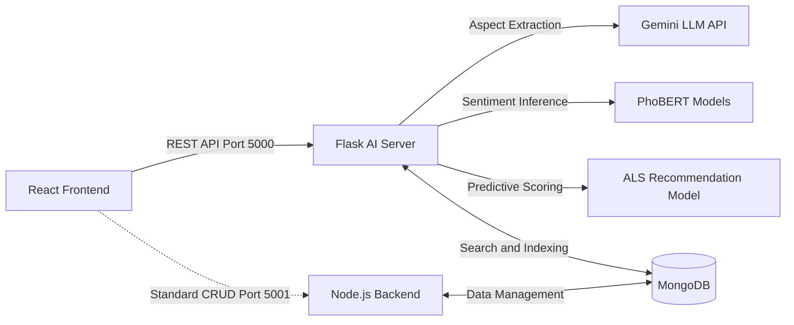

# Shopee Customer Sentiment Analysis Dashboard

> An E-commerce Customer Sentiment Analysis System for the Vietnamese market, utilizing a fine-tuned PhoBERT model on Shopee review data.

This project was developed to build an end-to-end Machine Learning solution that addresses core e-commerce challenges: extracting actionable insights from unstructured customer feedback and personalizing product discovery. The models were trained and evaluated on a custom dataset of approximately 13,490 authentic Vietnamese reviews scraped directly from Shopee.

## Demo


---

## Table of Contents

- [Overview](#overview)
- [Project Scope & Limitations](#project-scope--limitations)
- [Key Features](#key-features)
- [System Architecture](#system-architecture)
- [Technologies Used](#technologies-used)
- [Directory Structure](#directory-structure)
- [Installation & Setup](#installation--setup)
- [Main APIs](#main-apis)
- [Model Performance](#model-performance)
- [Future Enhancements](#future-enhancements)

---

## Overview

This system collects and analyzes customer reviews on Shopee, providing administrators and sellers with an intuitive dashboard to:

- Monitor customer sentiment in real-time.
- Perform Aspect-Based Sentiment Analysis (ABSA) across different product dimensions.
- Cluster products based on review topics and semantic similarities.
- Search and recommend products based on user interaction behavior.

## Project Scope & Limitations

Please note that this repository serves primarily as an exploratory research project and a proof-of-concept. The primary focus of this architecture is on the design and integration of the Machine Learning pipelines. 

As a result, the accompanying web application and backend gateway are implemented solely to demonstrate end-to-end functionality. They are not optimized for production-grade scalability, security, or advanced error handling. Reviewers may encounter exploratory code, unoptimized infrastructure, or redundancies typical of an academic research environment.

## Key Features

- **System Overview Dashboard:** A central management interface tracking core system metrics, including total products in the catalog, active users, total implicit interactions, and overall review volume.
- **ABSA Analytics & Evidence Tracking:** Visualizes sentiment distribution (Positive, Neutral, Negative, None) across 5 specific product aspects: Quality, Price, Delivery, Packaging, and Service. Includes an evidence extraction modal to investigate the raw negative reviews driving the metrics.
- **Product Issue Clustering:** Utilizes PhoBERT and K-Means to automatically group negative reviews for specific products into distinct thematic clusters. It extracts key phrases and provides sample reviews for rapid root-cause analysis.
- **Interactive Product Search & Interaction Logging:** A storefront simulation that allows administrators to search the product catalog and view details. It actively logs simulated user behaviors (e.g., `click_view` events tied to a `User_ID`) to dynamically feed the implicit feedback matrix required by the ALS recommendation engine.
- **Live Testing Modules:** Includes dedicated interface tabs for testing the Alternating Least Squares (ALS) recommendation outputs and running live inference on the fine-tuned ABSA model.

## System Architecture



## Technologies Used

| Component | Technology |
|---|---|
| **NLP Model** | PhoBERT (`vinai/phobert-base-v2`), fine-tuned |
| **Recommendation** | ALS Collaborative Filtering |
| **Clustering** | K-Means + PhoBERT semantic embeddings |
| **AI Server** | Flask `[version?]`, Python 3.x |
| **Database** | MongoDB (Mongoose `^9.7.4`) |
| **Backend Gateway** | Node.js, Express `^5.2.1` |
| **Frontend UI** | React `[version?]`, Vite `[version?]` |

## Directory Structure

```text
doan3_phantichcamxuckhachhang/
├── assets/                  # Illustrations and screenshots for README
├── back_end/                # Node.js/Express API Gateway
│   ├── controllers/
│   ├── models/
│   ├── routes/
│   ├── scripts/
│   └── server.js
├── data/
│   ├── raw/                 # Scraped raw data
│   ├── processed/           # Preprocessed data
│   └── sample/              # Small data samples for demonstration
├── front_end/               # React + Vite dashboard
│   ├── public/
│   └── src/
├── models/                  # Fine-tuned PhoBERT models (excluded from repo, see download instructions below)
├── notebook/                # Notebooks for research, EDA, and model training
├── scripts/                 # Utility scripts (check_models, setupdb, update_dataset...)
├── services/                # Service logic (dashboard_service, etc.)
├── app.py                   # Entry point for the Flask AI Server
├── requirements.txt
└── .env.example

```

## Installation & Setup

### Prerequisites

* Python 3.13+
* Node.js 18+
* MongoDB (Local or Atlas)

### 1. Clone the repository

```bash
git clone <repo-url>
cd doan3_phantichcamxuckhachhang

```

### 2. Configure Environment Variables

Copy `.env.example` to `.env` and fill in your actual values:

```bash
cp .env.example .env

```

### 3. Download Models & System Checkpoints

Due to GitHub's storage limits, the fine-tuned PhoBERT models and ALS matrices are hosted externally.

* **[Download from Google Drive](https://drive.google.com/file/d/1Lb0psT1bWDghCnCxCY6Ave1Rhl183r6B/view?usp=sharing)**

**Installation Note:** Download the `.zip` file and extract its contents directly into the `models/` directory at the root of the project. Ensure there are no nested folders (e.g., `models/models/...`) so the Flask API can locate the paths correctly.

### 4. Install & Run the Flask AI Server

```bash
pip install -r requirements.txt
python app.py

```

### 5. Install & Run the Backend Gateway

```bash
cd back_end
npm install
npm start

```

### 6. Install & Run the Frontend

```bash
cd front_end
npm install
npm run dev

```

## Main APIs

The core machine learning and data processing endpoints are served directly via the Flask backend (Port 5000):

### Machine Learning & AI
| Method | Endpoint | Description |
|---|---|---|
| `POST` | `/api/analyze-absa` | **ABSA Pipeline:** Extracts product aspects via Gemini LLM and infers sentiment (Positive, Neutral, Negative, None) using fine-tuned PhoBERT models. |
| `GET` | `/api/recommend` | **Recommender:** Returns personalized product rankings using the ALS model. Implements popularity-based fallback for cold-start users. |
| `POST` | `/api/analyze` | **Quick Inference:** Legacy endpoint for fast sentiment inference on predefined core aspects (Quality, Price, Delivery) without LLM extraction. |

### System & Data Retrieval
| Method | Endpoint | Description |
|---|---|---|
| `GET` | `/api/dashboard` | **Metrics Aggregation:** Calculates total reviews, ALS sparsity, and formats K-Means clustering data for the Admin Dashboard. |
| `GET` | `/api/evidence/<aspect>` | **Root-Cause Analysis:** Retrieves and samples raw negative reviews from the dataset for a specific aspect to provide evidence. |
| `GET` | `/api/products/search` | **Search Engine:** Performs MongoDB `$text` search and ranks product results based on algorithmic text-match scoring. |
| `POST` | `/api/log` | **Interaction Tracking:** Logs simulated user behavior (e.g., `click_view`) to populate the implicit feedback matrix. |

> *Note: The Node.js gateway (Port 5001) manages standard e-commerce CRUD operations (e.g., `/api/v1/recommendations` routes) and operates independently of the AI inference pipeline.*

## Model Performance

| Model | Accuracy | F1-macro |
| --- | --- | --- |
| PhoBERT (fine-tuned) | 95.7% | 0.954 |
| SVC + TF-IDF (baseline) | — | ~0.735 |

## Future Enhancements

* Expand towards multimodal sentiment analysis (e.g., combining rating embeddings with textual data).
* Improve the recommendation engine by integrating content-based filtering techniques.

---

## Author

**Trần Trọng Khang** — [GitHub](https://www.google.com/search?q=https://github.com/trantrongkhangttns)

```

```
