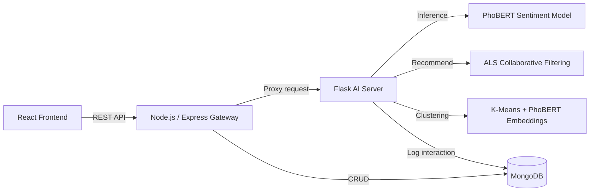

# Shopee Customer Sentiment Analysis Dashboard

> An E-commerce Customer Sentiment Analysis System for the Vietnamese market, utilizing a fine-tuned PhoBERT model on Shopee review data.

This project was developed to build an end-to-end Machine Learning solution that addresses core e-commerce challenges: extracting actionable insights from unstructured customer feedback and personalizing product discovery.
The models were trained and evaluated on a custom dataset of approximately 13,490 authentic Vietnamese reviews scraped directly from Shopee.


## Demo


---

## Table of Contents

- [Overview](#overview)
- [Key Features](#key-features)
- [System Architecture](#system-architecture)
- [Technologies Used](#technologies-used)
- [Directory Structure](#directory-structure)
- [Installation & Setup](#installation--setup)
- [Main APIs](#main-apis)
- [Model Performance](#model-performance)
- [Future Enhancements](#future-enhancements)

---

## Overview

This system collects and analyzes customer reviews on Shopee, providing administrators and sellers with an intuitive dashboard to:

- Monitor customer sentiment in real-time.
- Perform Aspect-Based Sentiment Analysis (ABSA) across different product dimensions.
- Cluster products based on review topics and semantic similarities.
- Search and recommend products based on user interaction behavior.

## Key Features

- **Sentiment Analysis:** A fine-tuned PhoBERT model classifies reviews into positive/negative sentiments with high accuracy.
- **ABSA Analytics:** Analyzes sentiment based on specific product aspects (e.g., price, quality, delivery).
- **Product Clustering:** Clusters products using PhoBERT semantic embeddings combined with K-Means.
- **Product Search & Recommendation:** Features a product search engine integrated with Alternating Least Squares (ALS) collaborative filtering for tailored recommendations.
- **Admin Dashboard:** A management interface that aggregates metrics, visualizes data through charts, and logs user interactions.

<!-- TODO: Adjust the feature list to perfectly match the actual functionalities implemented in AdminDashboard.jsx / AbsaAnalytics.jsx / ProductClustering.jsx / ProductSearch.jsx. -->

## System Architecture



## Technologies Used

| Component | Technology |
| --- | --- |
| Frontend | React, Vite |
| Backend Gateway | Node.js, Express |
| AI Server | Flask, Python |
| NLP Model | PhoBERT (vinai/phobert-base-v2), fine-tuned |
| Recommendation | ALS Collaborative Filtering |
| Clustering | K-Means + PhoBERT semantic embeddings |
| Database | MongoDB |

## Directory Structure

```text
doan3_phantichcamxuckhachhang/
├── assets/                  # Illustrations and screenshots for README
├── back_end/                # Node.js/Express API Gateway
│   ├── controllers/
│   ├── models/
│   ├── routes/
│   ├── scripts/
│   └── server.js
├── data/
│   ├── raw/                 # Scraped raw data
│   ├── processed/           # Preprocessed data
│   └── sample/              # Small data samples for demonstration
├── front_end/               # React + Vite dashboard
│   ├── public/
│   └── src/
├── models/                  # Fine-tuned PhoBERT models (excluded from repo, see download instructions below)
├── notebook/                # Notebooks for research, EDA, and model training
├── scripts/                 # Utility scripts (check_models, setupdb, update_dataset...)
├── services/                # Service logic (dashboard_service, etc.)
├── app.py                   # Entry point for the Flask AI Server
├── requirements.txt
└── .env.example

```

## Installation & Setup

### Prerequisites

* Python 3.13+
* Node.js 18+
* MongoDB (Local or Atlas)

### 1. Clone the repository

```bash
git clone <repo-url>
cd doan3_phantichcamxuckhachhang

```

### 2. Configure Environment Variables

Copy `.env.example` to `.env` and fill in your actual values:

```bash
cp .env.example .env

```

### 3. Download Fine-Tuned Models

Due to GitHub's storage limits, the fine-tuned PhoBERT models are hosted externally at: `<Google Drive/HuggingFace Link>`

Download and place them inside the `models/` directory.

### 4. Install & Run the Flask AI Server

```bash
pip install -r requirements.txt
python app.py

```

### 5. Install & Run the Backend Gateway

```bash
cd back_end
npm install
npm start

```

### 6. Install & Run the Frontend

```bash
cd front_end
npm install
npm run dev

```

## Main APIs

| Method | Endpoint | Description |
| --- | --- | --- |
| POST | `/api/sentiment/analyze` | Analyzes the sentiment of a single review |
| POST | `/api/log_interaction` | Logs user interaction behavior |
| GET | `/api/products/search` | Searches for products |
| GET | `/api/products/clusters` | Retrieves product clustering results |

## Model Performance

| Model | Accuracy | F1-macro |
| --- | --- | --- |
| PhoBERT (fine-tuned) | 95.7% | 0.954 |
| SVC + TF-IDF (baseline) | — | ~0.735 |

## Future Enhancements

* Expand towards multimodal sentiment analysis (e.g., combining rating embeddings with textual data).
* Improve the recommendation engine by integrating content-based filtering techniques.

---

## Author

**Trần Trọng Khang** — [GitHub](https://www.google.com/search?q=https://github.com/trantrongkhangttns)

```

```
